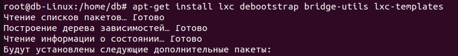
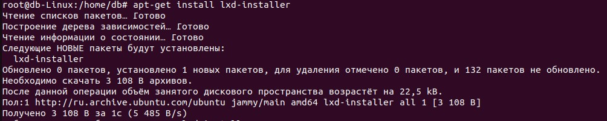
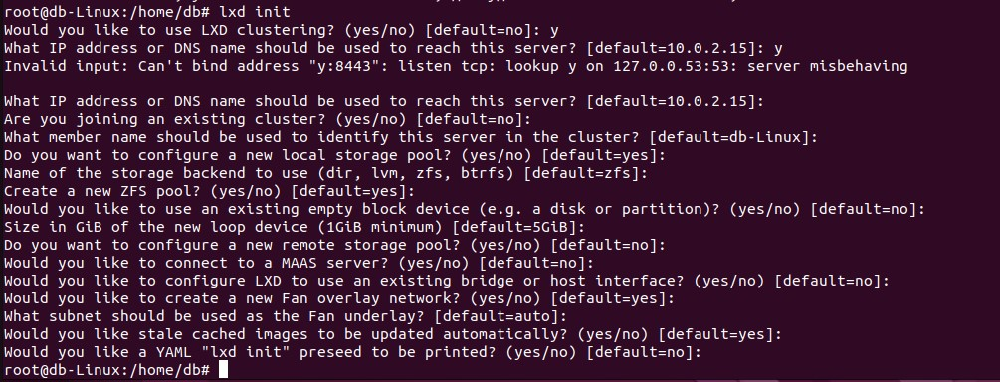
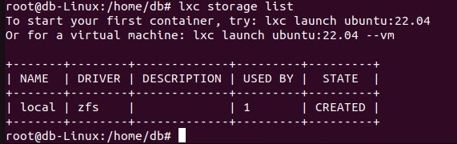
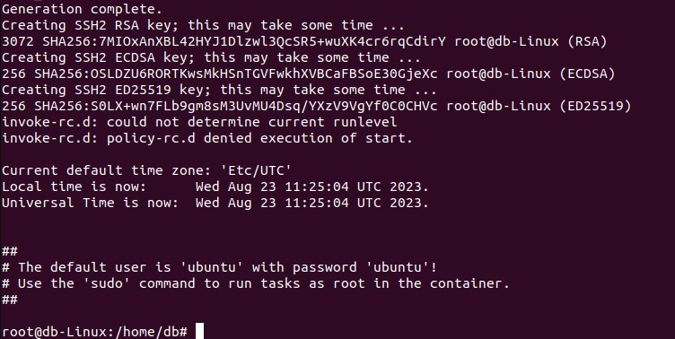
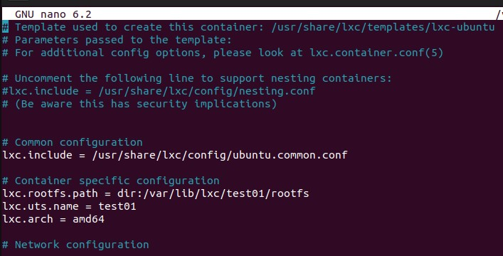
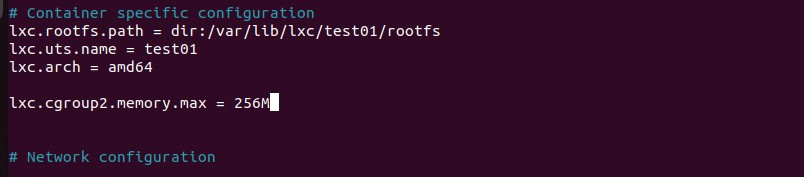
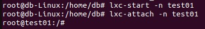
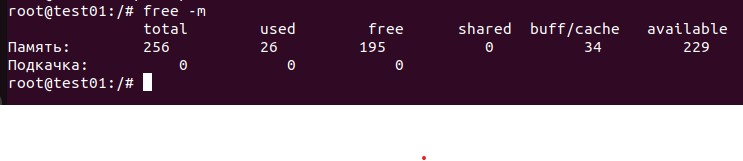

__Задание:__ *запустить контейнер с ubuntu, используя механизм LXC, ограничить контейнер 256 Мб ОЗУ и проверить, что ограничение работает*

1. Установка необходимых пакетов, создание lxc контейнера

apt-get install lxc debootstrap bridge-utils lxc-templates

apt-get install lxd-installer

lxd init

Проверяем:
lxc storage list

lxc-create -n test01 -t ubuntu -f /usr/share/doc/lxc/example/
lxc-veth.conf

2. Открываем файл конфигурации /var/lib/lxc/test123/config

3. Далее вставляем в файл конфигурации следующую строку:
lxc.cgroup2.memory.max = 256M

    После этого нужно сохраниться и выхйти. Теперь можно запустить контейнер и зайти в него.

    lxc-start -n test01

    lxc-attach -n test01 
    

    Проверяем память, введя команду: free -m и получаем следующий результат:
    

    

