Работа с Docker

1 - устанавливаем Докер
```
Обновим списки пакетов:
__
sudo apt update
Установим пакеты, которые позволят использовать репозиторий по HTTPS:
__
sudo apt install apt-transport-https ca-certificates curl software-properties-common
Добавим официальный GPG-ключ Docker:
__
curl -fsSL https://download.docker.com/linux/ubuntu/gpg | sudo gpg --dearmor -o /usr/share/keyrings/docker-archive-keyring.gpg

Добавим репозиторий Docker к списку источников пакетов:
__
echo "deb [signed-by=/usr/share/keyrings/docker-archive-keyring.gpg] https://download.docker.com/linux/ubuntu $(lsb_release -cs) stable" | sudo tee /etc/apt/sources.list.d/docker.list > /dev/null
Обновите список пакетов, чтобы включить информацию о пакетах Docker из добавленного репозитория:
__
sudo apt update
Установите Docker:
__
sudo apt install docker-ce
Добавьте вашего пользователя в группу docker, чтобы избежать использования sudo для запуска Docker команд:
__
sudo usermod -aG docker $USER
Перезагрузите систему или запустите следующую команду, чтобы применить изменения в текущем сеансе:
__
newgrp docker
Теперь вы должны быть готовы использовать Docker через терминал. Вы можете проверить его работу, выполнив команду:
__
docker --version
```
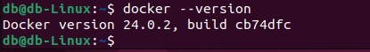

Докер установили....

2 -тестируем.

Запустим контейнер из образа Ubuntu и войдем в него:
__

docker run docker/whalesay cowsay Hello, Docker!
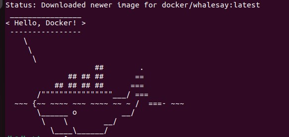
b@db-Linux:~$ docker run docker/whalesay cowsay -f elephant "Hello, Docker!"
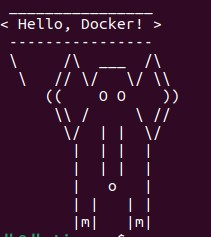


2. Запускаем контейнер из образа Ubuntu и входим в него:

docker run -it -h GB --name gb-test ubuntu:22.10
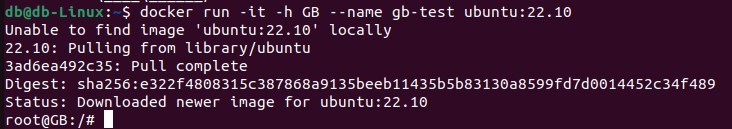

Далее создадим новую директорию в корневом каталоге:

mkdir /example

Теперь создадим файл "passwords.txt" и добавим в него данные:
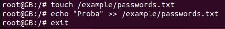

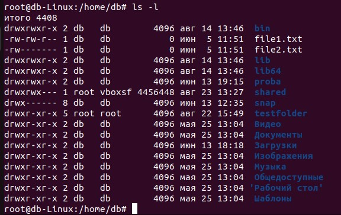 

3. Остановка контейнера и повторный запуск его.
Выполним последовательно команды:

docker stop gb-test

docker start gb-test

docker exec -it gb-test bash

cat /example/passwords.txt

exit
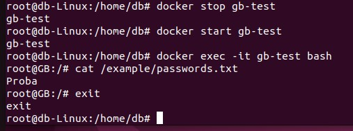

Так как мы не пересоздавали контейнер, все наши данные будут сохранены.

4. Удаление контейнера и создадание его сова. Используются те же команды:

docker stop gb-test

docker rm gb-test

docker run -it -h GB --name gb-test ubuntu:22.10

ls -l

exit

docker stop gb-test

docker rm gb-test
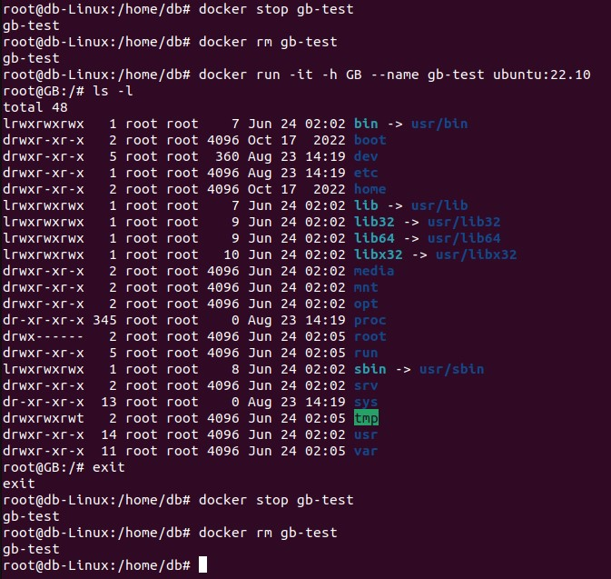

Из-за того, что контейнер удален, все наши даннные пропали.

5. Создаение новой директории и присоединение ее к контейнеру.

mkdir /test/folder
docker run -it -h GB --name gb-test -v /test/folder:/otherway ubuntu:22.10
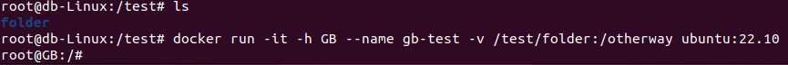

6. Добавление данных в присоединенную директорию:

echo "$HOSTNAME" >> /otherway/test.txt

ls
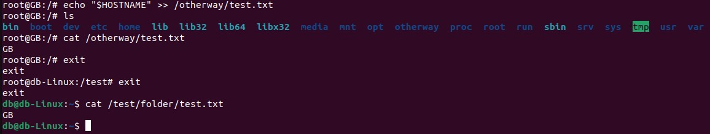

7. Удаление контейнера и создание его снова, монтирование в директорию, ичпользуя команды:

docker stop gb-test

docker rm gb-test

docker run -it -h GB --name gb-test -v /test/folder:/otherway ubuntu:22.10

cat /otherway/test.txt

exit

docker stop gb-test

docker rm gb-test
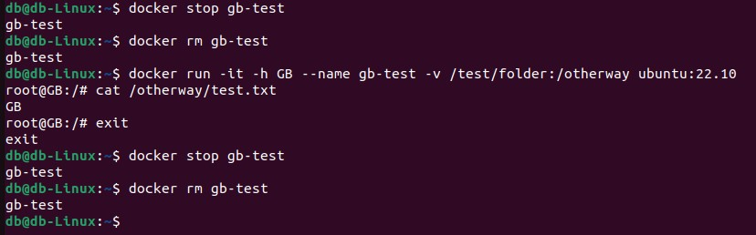

8. Хранение данных в контейнерах Docker.

Создадим две папки содержимое которых будет разным. Они понадобятся нам в будущем для монтирования. Контейнер создадим  из образа ubuntu:22.10.

mkdir ~/docker-mount-example

echo "This is the host test.txt file" > ~/docker-mount-example/test.txt

echo "This is the root test.txt file" > ~/test.txt

docker run -it -h GB --name gb-test -v ~/docker-mount-example:/container-mount -v ~/test.txt:/container-mount/test.txt ubuntu:22.10

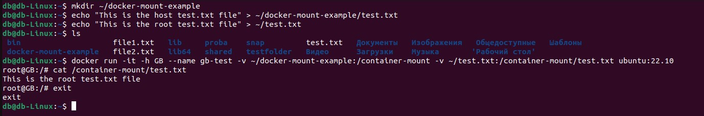

Теперь содержимое /container-mount/test.txt было перезаписано вторым монтированием из файла ~/test.txt


