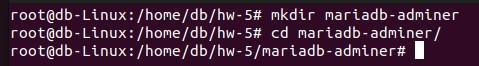
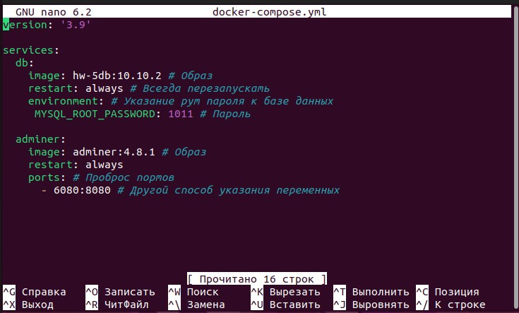
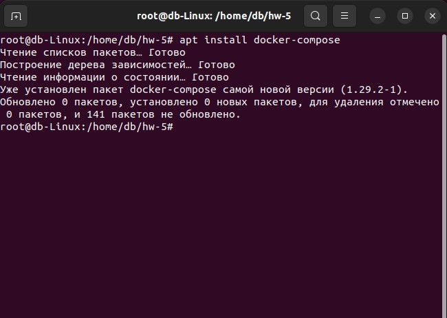
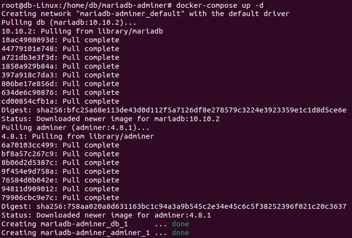
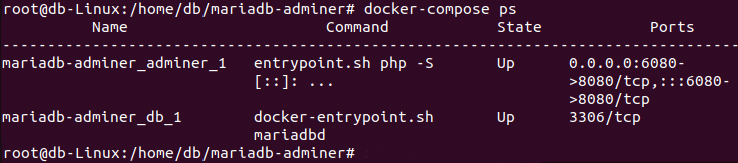
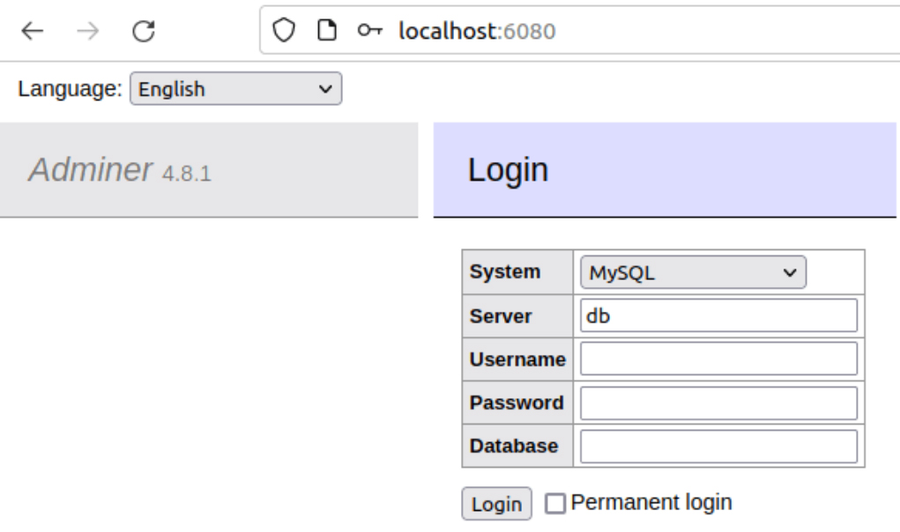
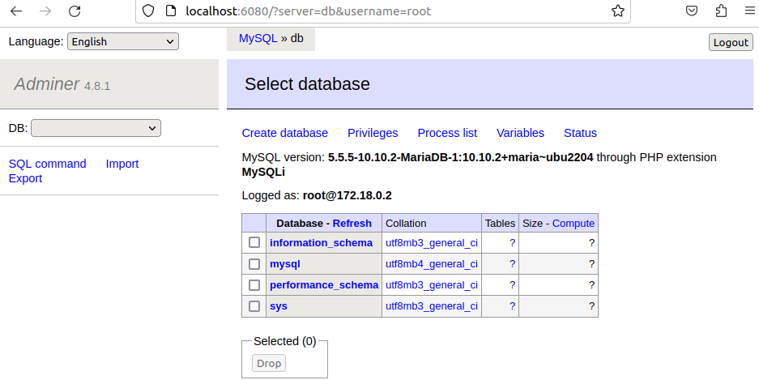

## Задание:  
создать сервис, состоящий из 2 различных контейнеров: 1 - веб, 2 - БД (compose)

1. Создание директории и переход в нее:

2. Далее создадим в папке yaml-файл с именем по умолчанию docker-compose.yml.

3. Устанавливаем docker-compose

Так-как он у меня уже установлен, то linux проверил, нужны ли обновления и по итогу ничего не установил. (_Уже установлен пакет docker-compose самой новой версии (1.29.2-1)_)

4. Далее создадим и запустим проект, в фоновом режиме, Имя yaml-файла при этом не указываем, т.к. он имеет имя по умолчанию.

5. Проверяем, что появились два контейнера.

6. Далее нами выполняется проброс портов. А именно - из порта контейнера 8080 на порт хоста 6080 Для того, чтобы открыть веб-приложение (в данном случае Adminer), нужно открыть страницу с адресом http://localhost:6080

7. Заполняем форму __Username:__ root и __Password:__  - тот, который мы указали в файле *docker-compose.yml* в переменных средах - __1011__, и входим в Adminer. Окно обновится и нам станет доступна база данных MariaDB
